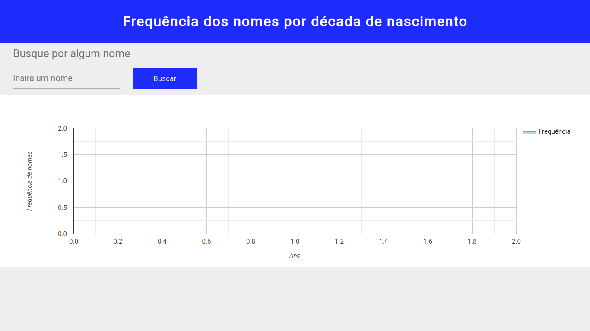
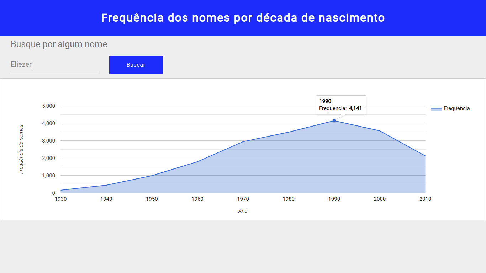

<h1>A aplicação disponibiliza um gráfico com a frequência dos nomes por década de nascimento de acordo com o censo do IBGE.</h1>

<h1>
  
</h1>

<h3>Abaixo o gráfico mostra a frequência do nome "Eliezer" por década de nascimento.</h3>

<h1>
  
</h1>

<h3>Para executar a aplicação é necessário os seguintes comandos:</h3>

> yarn install
> yarn start
